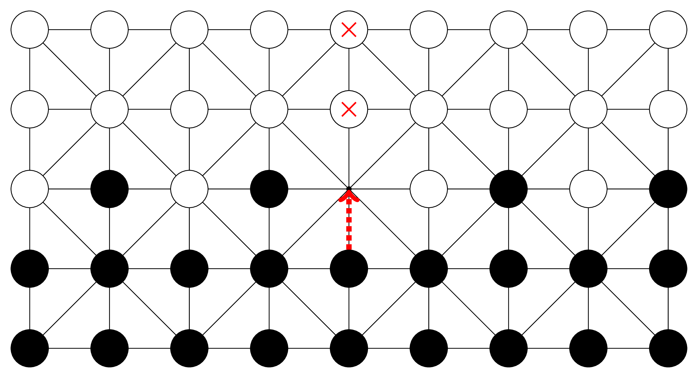
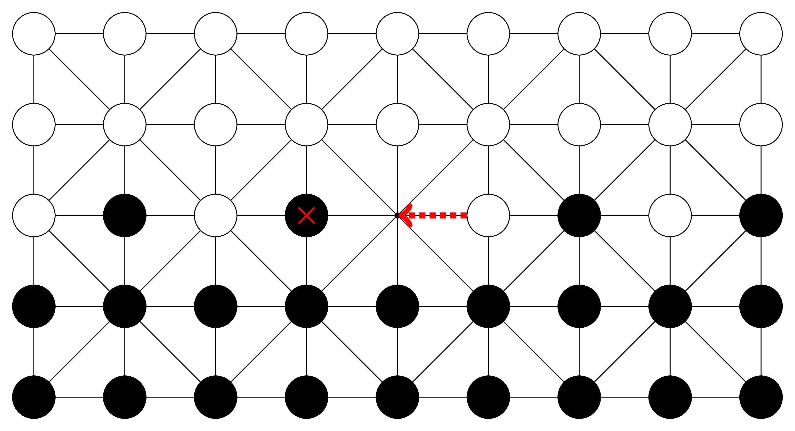
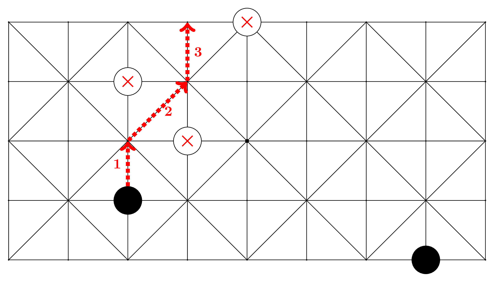
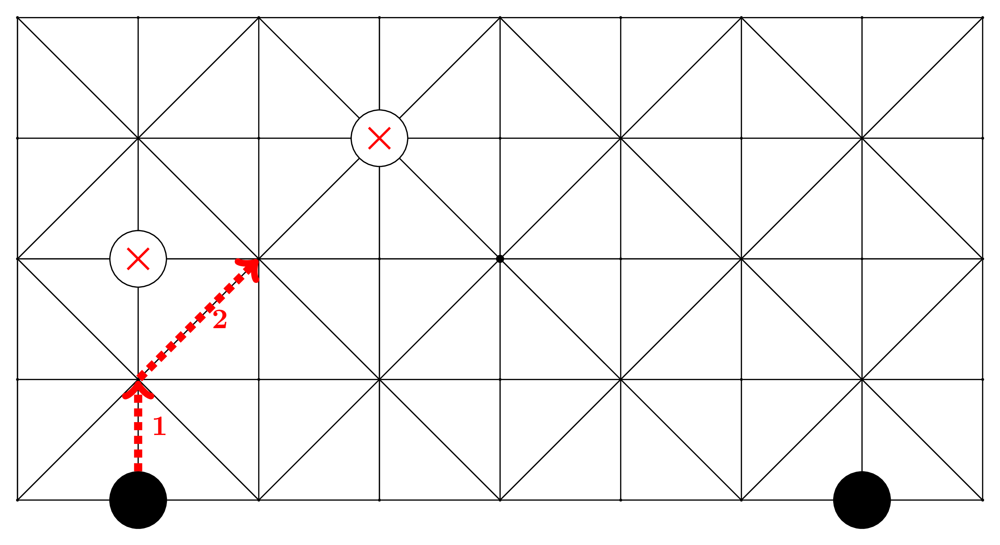
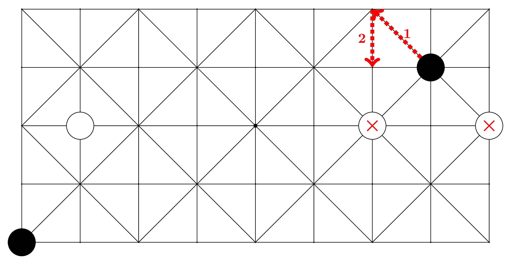
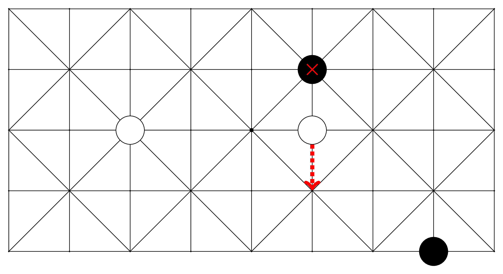

# Fanorona

In this repository, you will find drawings of the board game from
Madagacar called Fanorona. I created this repository to explain its
rules via illustration for the [FANORONA's
page](https://mg.wikipedia.org/wiki/Fanorona) on [malagasy version of
wikipedia](https://mg.wikipedia.org/wiki/Wikipedia:Fandraisana).

If you speak and write malagasy very well, I encourage you to
contribute to the [malagasy version of
wikipedia](https://mg.wikipedia.org/wiki/Wikipedia:Fandraisana).

## Examples

### Fanorontelo

### Fanorondimy

### Fanorontsivy

### Vaky Loha

### Kobaka fohy

### Kobaka lava

### Havanana

### Havia
	

### Mandroso

### Mikileva

### Mihemotra

### Miriana

### Mielatra

### Mihazakazaka

### Miforitra

### Midona

### Mivadika

### Migemo

### Miampify

### Manenjana

### Mamoina

### Mikizo

### Mitsindrona

