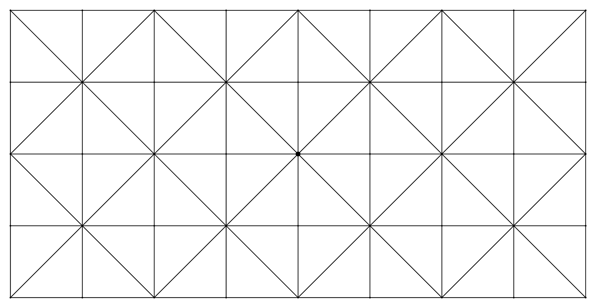
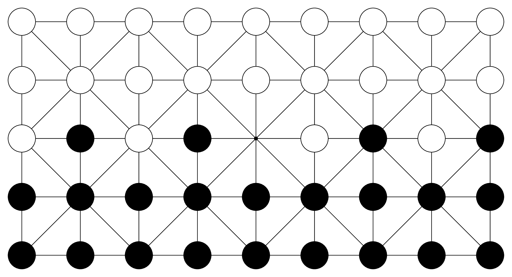
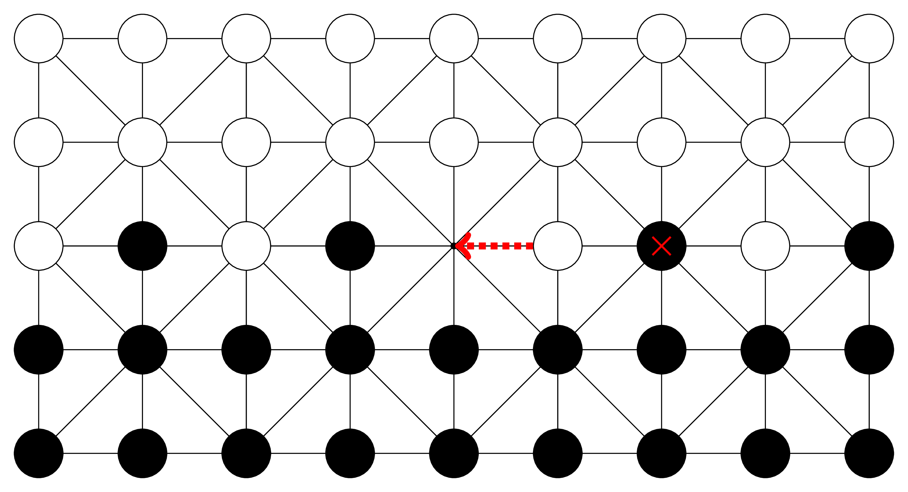
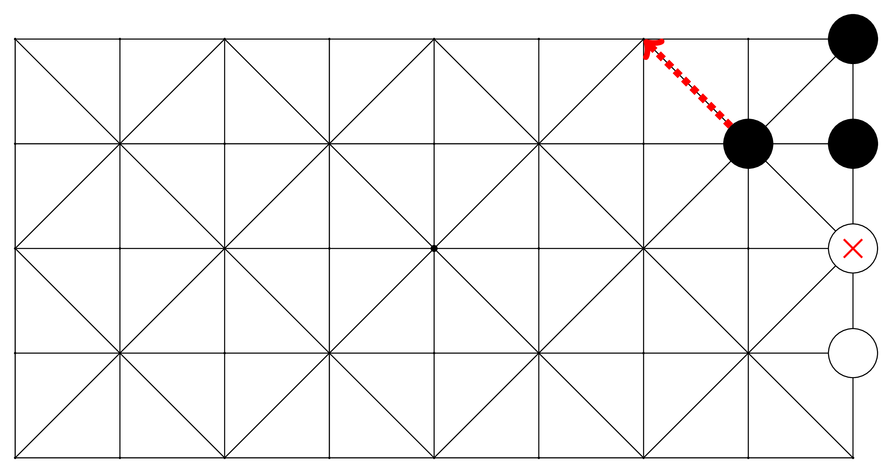

# Fanorona

In this repository, you will find drawings of the board game from
Madagacar called Fanorona. I created this repository to explain its
rules via illustration for the [FANORONA's
page](https://mg.wikipedia.org/wiki/Fanorona) on [malagasy version of
wikipedia](https://mg.wikipedia.org/wiki/Wikipedia:Fandraisana).

If you speak and write malagasy very well, I encourage you to
contribute to the [malagasy version of
wikipedia](https://mg.wikipedia.org/wiki/Wikipedia:Fandraisana).

## Compile

There is a Makefile. The first rule is `png` so the command `make`
will build a `.png` file. If you want a `pdf` file, run `make pdf`.

## Examples

	

